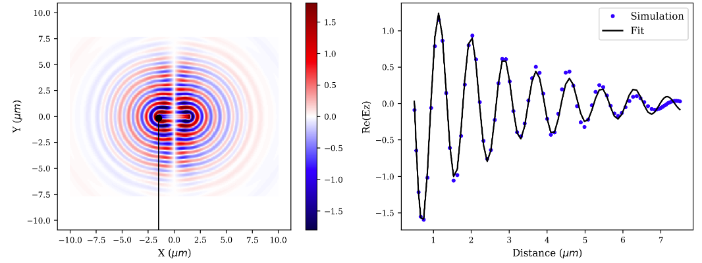
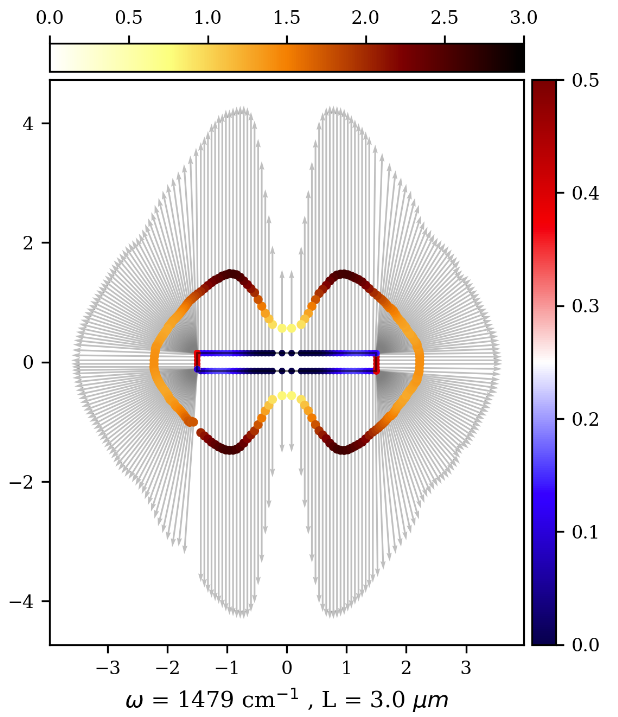
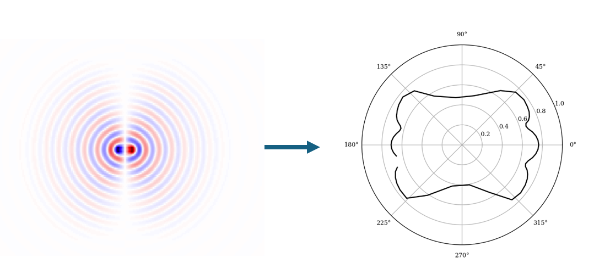

# Extracting Antenna Parameters from EM Simulations

This project is dedicated to extracting and displaying near-field features of nano-antennas on two-dimensional crystals. It provides tools to analyze electromagnetic (EM) simulations and visualize the resulting antenna parameters.

## Description

In this project, we aim to facilitate the analysis of near-field features in nano-antennas, which are crucial for developing advanced nanophotonic devices. By leveraging EM simulation data, the project allows for the extraction of key antenna parameters and their visualization, aiding in the design and optimization of nano-antennas on two-dimensional materials.

### Fresnel Waves and Field Profile

*Figure 1: (Left) Fresnel waves launched by the nano-antenna. The black line indicates the path where the field was extracted. (Right) The field profile and the fit curve used to extract the antenna features along this direction.*

This figure illustrates the initial step of our analysis, where Fresnel waves are launched by the nano-antenna. The black line marks the path along which the field is extracted, and the resulting field profile is shown alongside the fit curve used to determine the antenna's features.

### Resulting Features for Each Direction

*Figure 2: The resulting features for each calculated direction. Each colorscale represents a different parameter, and the arrow size represents how far the wave propagates.*

This figure shows the extracted features for each calculated direction. Different colorscales represent various parameters, while the arrow size indicates the propagation distance of the waves. This comprehensive visualization helps in understanding the directional characteristics of the antenna.

### Fraunhofer Waves as Polar Plots

*Figure 3: Another case (Fraunhofer) where the waves are circular and the features can be expressed as polar plots.*

In another scenario, Fraunhofer waves are depicted, which are circular. The features in this case can be expressed as polar plots, providing a different perspective on the antenna's behavior.

For a comprehensive understanding of the methodology and applications, please refer to the original article:  
**[Guidelines for Engineering Directional Polariton Launchers](https://journals.aps.org/prapplied/abstract/10.1103/PhysRevApplied.18.034089)**  
Mayer, R. A., Feres, F. H., Maia, F. C., Barcelos, I. D., McLeod, A. S., Rodin, A., & Freitas, R. O. (2022). Physical Review Applied, 18(3), 034089.

## License

This code is licensed under the Creative Commons Attribution 4.0 International License. You can view the full license [here](https://creativecommons.org/licenses/by/4.0/).

### Attribution

When using this code, please cite the following work:

Mayer, R. A., Feres, F. H., Maia, F. C., Barcelos, I. D., McLeod, A. S., Rodin, A., & Freitas, R. O. (2022). Guidelines for Engineering Directional Polariton Launchers. Physical Review Applied, 18(3), 034089.
